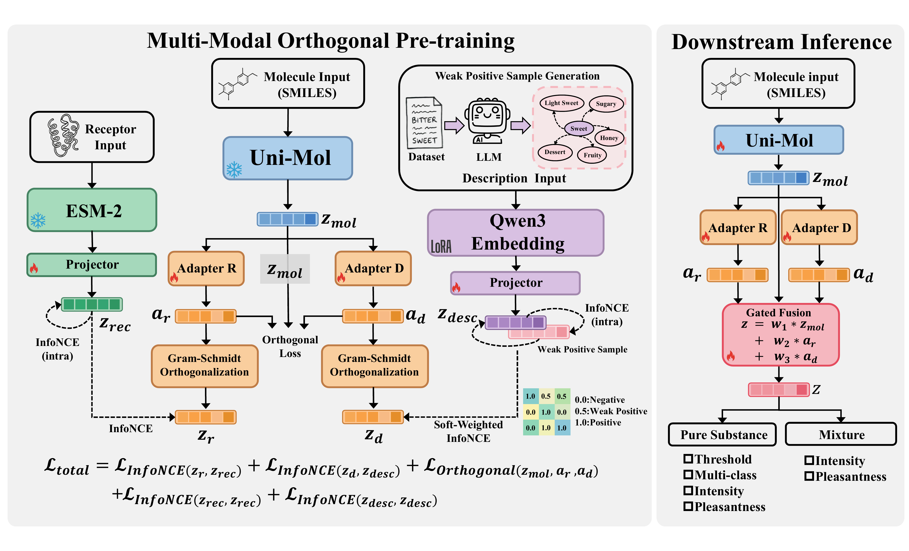

# NOSE: Neural Olfactory-Semantic Embedding with Tri-Modal Orthogonal Contrastive Learning

<p align="center">
  <b>ACL 2026 Main Conference</b>
</p>

<p align="center">
  Yanyi Su<sup>1,2</sup> &nbsp;
  Hongshuai Wang<sup>2</sup> &nbsp;
  Zhifeng Gao<sup>2*</sup> &nbsp;
  Jun Cheng<sup>1,3,4*</sup>
</p>

<p align="center">
  <sup>1</sup>College of Chemistry and Chemical Engineering, Xiamen University &nbsp;
  <sup>2</sup>DP Technology &nbsp;
  <sup>3</sup>AI4EC, IKKEM &nbsp;
  <sup>4</sup>Institute of Artificial Intelligence, Xiamen University
</p>

<p align="center">
  <a href="https://arxiv.org/abs/2604.10452"></a>
  <a href="https://github.com/Xianyusyy/NOSE"></a>
  <a href="https://github.com/Xianyusyy/NOSE/blob/main/LICENSE"></a>
</p>

## Abstract

Olfaction lies at the intersection of chemical structure, neural encoding, and linguistic perception, yet existing representation methods fail to fully capture this pathway. Current approaches typically model only isolated segments of the olfactory pathway, overlooking the complete chain from molecule to receptors to linguistic descriptions. Such fragmentation yields learned embeddings that lack both biological grounding and semantic interpretability. We propose **NOSE** (Neural Olfactory-Semantic Embedding), a representation learning framework that aligns three modalities along the olfactory pathway: **molecular structure**, **receptor sequence**, and **natural language description**. Rather than simply fusing these signals, we decouple their contributions via orthogonal constraints, preserving the unique encoded information of each modality. To address the sparsity of olfactory language, we introduce a weak positive sample strategy to calibrate semantic similarity, preventing erroneous repulsion of similar odors in the feature space. Extensive experiments demonstrate that NOSE achieves state-of-the-art (SOTA) performance and excellent zero-shot generalization, confirming the strong alignment between its representation space and human olfactory intuition.

## Framework

<p align="center">
  
</p>

## Updates

- **[2026/04]** Paper accepted at ACL 2026! Code and data will be released before the conference.

## TODO

- [ ] Release pre-trained model weights (projection heads, adapters, LoRA weights)
- [ ] Release LLM-augmented SMILES-descriptor dataset (2,567,558 pairs)
- [ ] Release inference code and embedding extraction API
- [ ] Release demo notebooks (odor retrieval, zero-shot prediction, smell algebra, space visualization)

## Project Structure

```
NOSE/
├── README.md
├── LICENSE
├── requirements.txt
├── assets/                    # Paper figures
├── data/                      # LLM-augmented SMILES-descriptor pairs
├── model/                     # Model configs and weight download instructions
├── nose/                      # Core inference code
│   ├── model.py               # NOSE model (adapters + projection heads)
│   ├── encoders.py            # Uni-Mol / ESM-2 / Qwen3-Embedding wrappers
│   └── inference.py           # Inference API
└── demos/                     # Demo notebooks
    ├── odor_retrieval.ipynb
    ├── zero_shot.ipynb
    ├── smell_algebra.ipynb
    └── space_visualization.ipynb
```

## Pre-trained Encoders

NOSE builds upon the following pre-trained models:

| Modality | Encoder | Source |
|----------|---------|--------|
| Molecular Structure | [Uni-Mol](https://huggingface.co/dptech/Uni-Mol-Models) | 3D molecular conformations |
| Receptor Sequence | [ESM-2 (650M)](https://huggingface.co/facebook/esm2_t33_650M_UR50D) | Protein language model |
| Odor Description | [Qwen3-Embedding-8B](https://huggingface.co/Qwen/Qwen3-Embedding-8B) | Text embedding model |

## Downstream Task Data

Downstream evaluation datasets are publicly available via [pyrfume-data](https://github.com/pyrfume/pyrfume-data) (MIT License).

## Citation

If you find this work useful, please cite:

```bibtex
@inproceedings{su2026nose,
  title     = {NOSE: Neural Olfactory-Semantic Embedding with Tri-Modal Orthogonal Contrastive Learning},
  author    = {Su, Yanyi and Wang, Hongshuai and Gao, Zhifeng and Cheng, Jun},
  booktitle = {Proceedings of the 64th Annual Meeting of the Association for Computational Linguistics (ACL)},
  year      = {2026}
}
```

## License

This project is licensed under the [MIT License](LICENSE).
